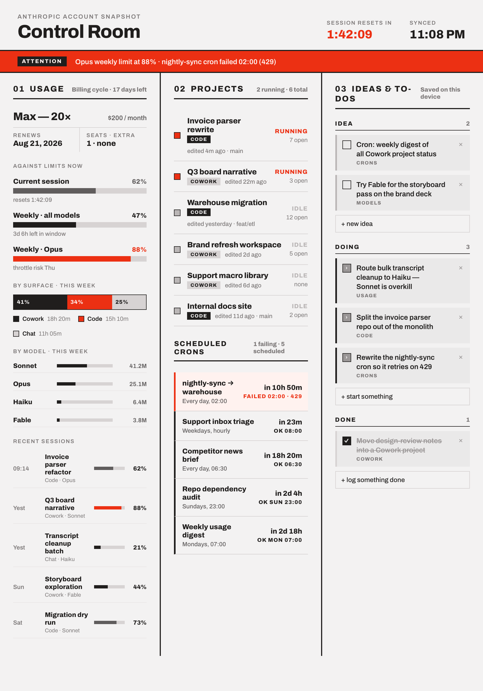

# Claude Control Room

A single-screen operational dashboard for one person's Claude account: spend against
limits, running projects and scheduled crons, and a personal backlog. Three equal
columns, built to be read at a glance from a desk browser and an iPad. It runs as a
background service on an always-on Mac and shows real data pulled from the local
machine — nothing is faked, and anything that has no real source says so.



*(This is the design reference the UI was built to match pixel-for-pixel — see
[Fragility](#fragility) for why a live screenshot isn't checked in.)*

**This is a personal tool for one machine and one account.** The source is public so it
can be read, learned from, and adapted, but it is not a product: it targets one person's
file layout, one person's home directory, and CLI output that Anthropic does not
document or version. See [Adapting it](#adapting-it) before assuming it will run
anywhere else unmodified.

## What it shows, and where the numbers come from

Every panel is wrapped in a status of `ok`, `stale`, or `unavailable`. A `stale` panel
shows the last good data with a visible marker instead of silently going quiet, and an
`unavailable` panel shows its frame and heading with an explicit no-source state —
never a zero or an empty bar standing in for missing data.

| Panel | Source | Reality |
|---|---|---|
| Header countdown | `claude -p "/usage"` reset timestamp | Real |
| Plan block — tier | `claude auth status --json` (`subscriptionType`) | Real, but coarse and can lag a plan change by days — see below |
| Plan block — price, renews, seats | `config.json` | Static — no API exposes pricing, renewal date, or seat count |
| Credits (balance, spend, resets, promo) | `config.json`, or the `/api/ingest/credits` feed | Hand-entered / manually updated, staleness-marked |
| Three limit bars (session, weekly all-models, weekly per-model) | `claude -p "/usage"` | Real |
| By surface · this week (Cowork / Code / Chat) | Session-log token sums under both transcript roots | Real for Cowork and Code; **Chat is permanently unmeasurable** — see below |
| By project · this week | Same transcript roots, top 3 by tokens + Other | Real |
| By model · this week | Same transcript roots | Real |
| Recent sessions | Same transcript roots; percent = that session's share of the week's tokens | Real |
| Pace tick + projection on each limit bar | `/usage` history (see below) plus an observed window length | Real, but the session bar has no fallback — see below |
| Sparklines on each limit bar | Same history store | Real; needs at least two readings, else says so |
| Usage drivers panel | `/usage`'s contributing-factors block | Real, but **local-machine-only and approximate** — unlike every account-wide percentage above it in the same column, see below |
| Projects (column 02) | `claude agents --json` + Cowork session metadata + transcript logs + git branch | Real |
| Scheduled crons | `~/Library/LaunchAgents/*.plist` + `launchctl list`, plus `/api/ingest/crons` for anything that reports in from elsewhere | Real |
| Ideas & to-dos (column 03) | `server/todos.json`, read and written through the server | Real, but local state, not derived from any external source |

**Chat (claude.ai) is not a temporary gap — it has no local source and never will.**
Conversations there are server-side; the client never computes or exposes
per-conversation token usage anywhere on disk. The UI renders the Chat segment
explicitly labeled "not measurable locally" rather than omitting it or showing zero.

**Project task counts are not shown.** No source (agents JSON, session logs, or
anything else on this machine) reliably gives an open-task count per project, so that
field is `null` end-to-end and the UI simply doesn't print the line — it does not
invent a number.

## Pace, history, and the usage-drivers panel

### Why there's a history store at all

The transcript-backed panels this dashboard shows can be recomputed after the
fact — token counts, project activity, and session lists all live on disk in
transcripts that aren't going anywhere. The `/usage` percentages are different: they are a
point-in-time reading with no record behind them. Miss a poll, or don't capture
the number the moment it's printed, and that moment is gone permanently — there is
no transcript to recompute it from later. That's the entire reason
`server/history.mjs` exists: it appends every successful `/usage` reading to
`server/data/usage-history-YYYY-MM.jsonl` (gitignored — this is runtime data, not
source) so the dashboard can show a trend instead of only a snapshot.

The store is append-only and month-rotated, one record per **successful** poll —
a failed, stale, or absent reading writes nothing, so a gap in the file always
means "no reading," never "a reading of zero." Retention is indefinite (the data
is non-recoverable and the volume is trivial — roughly 21 MB a year at one
reading every five minutes), while the server keeps the most recent 30 days in
memory to serve sparklines. That 30 days is a **single constant**,
`RETENTION_MS` in `server/history.mjs`: `server.mjs` asks the store for exactly
that span and `lib/usage-panel.mjs` caps a sparkline's range to it, so widening
retention actually widens the series instead of silently doing nothing. At startup it warms that window by loading enough
trailing month files to cover the configured retention, not a fixed count — a
walk-back derived from retention rather than fixed to two months, precisely so a
longer retention setting doesn't silently lose its oldest data. At the default
30-day retention that currently means three month files (the current month plus
the two before it). A corrupt line is skipped on read, the same tolerance the
transcript parser already has — the store never seeds, fabricates, or rewrites a
file to "repair" it.

### Pace: the session window length is observed, not assumed

`/usage` tells you when a limit's window *ends* but never how long that window
*is*. Weekly windows can fall back to a plausible default because the label
itself says "Current week" — seven days. **The session window has no such
label and gets no fallback.** Instead, the dashboard watches the history for a
window rolling over and reads the length off the jump.

A forward jump is **not** automatically one window length, and treating it as
one produced real, wrong numbers on this dashboard. Session windows are
user-initiated, so they aren't contiguous: after an idle spell the next window
starts when you send the next message, and the jump spans *idle + window*. The
printed reset also flaps by a minute between polls (`07:49` / `07:50` both
appear in captured history), so a rollover first caught on the low side
"recovers" into a one-minute jump. `server/lib/pace.mjs` therefore accepts a
jump as evidence only when all of these hold:

- **We saw it happen.** The jump must be first seen within
  `MAX_ROLLOVER_LATENESS_MS` (15 minutes, three poll intervals) of the reset it
  supersedes. This is not a confidence heuristic: since the new window began at
  or after the old reset and had certainly begun by the time we saw its new
  reset, the lateness of that sighting is an *exact upper bound* on how much of
  the jump could be idle — so a punctual sighting is an accurate measurement,
  and a late one measures nothing. Applied in both directions: a jump seen
  before the old reset is not a rollover, because that window hadn't ended.
- **It is a plausible window.** Anything under `MIN_PLAUSIBLE_WINDOW_MS`
  (30 minutes) is rejected outright — that is the minute-flap, not a window. A
  flap caught right at a rollover is perfectly punctual, so this floor, not the
  lateness rule, is the only thing that rejects it.
- **The most recent accepted observation wins**, rounded to the minute. That is
  what makes the inference self-correcting: if Anthropic changes a window
  length, the next clean rollover reports it. Preferring a *repeated* length
  instead would keep reporting the old window until the new one had been seen
  more often — days of a knowingly stale number.
- **The baseline only ever advances**, so a backward blip followed by a recovery
  can't manufacture a rollover that never happened.

If nothing survives, the answer is `null` — window length not yet observed — and
no pace is shown. Accepting a suspicious jump just to have an answer is exactly
the failure this project exists to avoid.

The practical consequence: **pace is unavailable on a freshly-started history**
for the session bar, until the first rollover is observed — potentially the
first several hours of running the dashboard for the first time. The bar states
this plainly (`window length not yet observed`) rather than guessing a number that would
look real but isn't. Once a rollover has been seen, pace shows a tick mark at
where you'd be if usage were burning evenly, plus a line reading `on pace`,
`ahead of pace · projected N% by reset`, or `under pace` — with no projection
at all when less than 10% of the window has elapsed, since dividing by a small
elapsed fraction produces wild, trust-eroding numbers. If the reset being held
has already passed — a stale reading with the countdown beside it reading
`00:00` — the line says `window ended · awaiting a fresh reading` rather than
projecting to a deadline that is behind us.

Two further honesty rules on the sparklines. A series is **decimated
server-side** to `MAX_SERIES_POINTS` (240) before it goes on the wire: the line
is 120 CSS pixels wide, so a full 30-day series at one poll per five minutes
would ship ~72 points per pixel every 30 seconds, over a tunnel, to be drawn on
top of each other. Decimation keeps each bucket's highest and lowest *actual*
readings plus the newest one — it never averages, smooths or invents a point. And
if the store cannot read or write its own files, the bar says **`History
unavailable`** with the failure code rather than `Not enough history yet`: the
second promises that waiting will fill the line, and when `server/data/` is
unwritable, waiting fixes nothing.

### The usage-drivers panel is local-machine-only, and does not sum to 100

Every poll of `/usage` also prints a contributing-factors block — request and
session counts plus behavioural percentages like "74% of your usage was at
>150k context" — that earlier versions of this dashboard parsed and discarded.
The drivers panel at the bottom of column 01 renders it instead, using the same
name/track/percentage row idiom as the model breakdown above it, deliberately
**not** as a stacked bar or pie: Anthropic's own output describes these as
independent characteristics, not a breakdown, and they do not sum to 100.

Unlike the account-wide limit percentages higher in the same column, this panel
is **local-machine-only and approximate** — it reflects sessions on this
machine only, not other devices and not claude.ai, and the panel says so
visibly rather than leaving two figures of different provenance sitting in one
column with no distinction between them. The factors block also parses
leniently, unlike the limit lines above it: a malformed or missing factors
block yields an unavailable drivers panel without ever affecting the limit
bars, which still parse strictly and throw on drift.

## Why it shells out to the `claude` CLI

**There is no usage or cost API for a consumer Claude subscription.** The Console
usage/cost endpoints and the Admin API exist for Console organizations only; this
account is a Max subscription with no Console org behind it. The only place this
machine's actual usage percentages and reset timestamps exist is the text that
`claude -p "/usage"` prints to a terminal, the only place a live agent/session list
exists is `claude agents --json`, and the only place the plan tier exists at all —
even a lagging, coarse version of it — is `claude auth status --json`.

So the server runs those commands non-interactively on a timer, parses the output, and
caches the result. This is deliberate and is the documented reason it works this way —
**do not "fix" this into an API call.** If Anthropic ships a usage API for consumer
accounts, that would be a real improvement; until then, shelling out to the CLI the
user is already authenticated with is the only source that exists, and it is exactly
why `usage`, `agents`, and `plan` are the collectors that can go `unavailable` if
`claude` isn't on the service's `PATH` (see [Running it](#running-it)).

## Architecture

```
claude-control-room/
  server/
    collectors/     one module per source, each on its own timer, cache-only reads at request time
    cache.mjs        in-memory: { data, fetchedAt, status, error } per panel
    history.mjs      append-only /usage snapshot store — see "Pace, history, and the usage-drivers panel"
    routes.mjs        /api/dashboard · /api/todos · /api/ingest/*
    config.json        user-set values with no API source (gitignored — see config.example.json)
    todos.json          the column 03 backlog (gitignored)
    data/              usage-history-YYYY-MM.jsonl, append-only, gitignored (runtime data, not source)
  web/               React + Vite SPA; the server serves the built web/dist bundle
  deploy/            launchd plist template for running the server as a background service
```

Collectors write to cache on a timer; HTTP requests only ever read cache — nothing
shells out on page load. Each collector fails independently: one dying (e.g. `claude`
not being reachable) leaves every other panel intact.

| Collector | Source | Interval |
|---|---|---|
| `usage` | `claude -p "/usage"` | 5 min |
| `sessions` | Claude Code and Cowork transcript roots (`~/.claude/projects` and the Cowork session directory), incremental by mtime | 60 s |
| `agents` | `claude agents --json` | 30 s |
| `crons` | `~/Library/LaunchAgents/*.plist` + `launchctl list` | 60 s |
| `plan` | `claude auth status --json` (tier only — see [Configuration](#configuration)) | 60 min |
| `ingest` | inbound `POST` to `/api/ingest/{crons,projects,credits}`, no timer | — |

The server holds no API key — there is nothing to hold. It shells out to the `claude`
CLI the user is already logged into, and reads local files. It binds to
`127.0.0.1` only; nothing about it is exposed to the network by the server itself.

### What the ingest endpoints require

They are unauthenticated by design (loopback only), so they are narrow instead:

- `Content-Type: application/json` — required. This also stops them being CORS
  *simple* requests, which is what made them reachable from any page the browser
  happened to have open.
- an `Origin` header, if present, must match this server's own host; anything else
  is refused with a 403.
- bodies over 256 KB are refused with a 413 rather than buffered.
- each payload is validated before it is cached — `crons` and `projects` must be
  arrays of objects carrying at least a `name`, `credits` must be an object of
  numbers and date strings — and unknown fields are dropped rather than reaching
  the page. A feed that does not say whether a cron passed leaves that unknown; it
  is never filled in as a pass.

```bash
curl -X POST http://127.0.0.1:8322/api/ingest/crons \
  -H 'Content-Type: application/json' \
  -d '[{"name":"cloud-digest","ok":false,"last":"Failed · 1","schedule":"Daily, 07:00"}]'
```

## Running it

### Prerequisites

- Node.js (developed against v26; anything reasonably current should work)
- The `claude` CLI installed and already authenticated (`claude auth status` should
  show a logged-in session)
- macOS, since crons are read from `launchd` and `plutil`, and Cowork sessions are read
  from a macOS-specific path — this has not been ported to another OS

### Tests and build

```bash
cd server && npm test      # 267 tests, pure-function and collector-seam unit tests, no network, no shelling out to `claude`
cd web && npm run build    # produces web/dist, which the server serves
```

(`server/package.json` also exposes `npm run build` as a convenience alias that runs
the web build from the server directory.)

### Run it directly (foreground, for trying it out)

```bash
cd server && node server.mjs
# then open http://127.0.0.1:8322/
```

### Run it as a background service (launchd)

The repo is public, so what's checked in is `deploy/control-room.plist.example` — a
template with `__HOME__` and `__REPO__` placeholders — not a real plist with this
machine's absolute paths. Generate the real one locally and keep it out of git (the
`.gitignore` already excludes `deploy/*.plist` while keeping `*.plist.example`):

The label in the example is `local.control-room`. It is arbitrary — any reverse-DNS
label works, as long as the filename, the `Label` key and every `launchctl` command
you run agree. Substitute your own below if you prefer.

```bash
LABEL=local.control-room

sed -e "s#__HOME__#$HOME#g" -e "s#__REPO__#$(pwd)#g" \
  deploy/control-room.plist.example > "deploy/$LABEL.plist"

cp "deploy/$LABEL.plist" ~/Library/LaunchAgents/
launchctl load ~/Library/LaunchAgents/"$LABEL".plist
```

Give it a minute or two — the `usage` collector shells out to `claude` and that call
alone can take up to 90 seconds — then check:

```bash
launchctl list | grep control-room
curl -s http://127.0.0.1:8322/api/dashboard \
  | python3 -c "import json,sys; d=json.load(sys.stdin); print({k: v.get('status') for k,v in d.items() if isinstance(v, dict)})"
```

`usage`, `sessions`, `agents`, and `crons` should all read `ok`. If any of them says
`unavailable`, check `~/Library/Logs/control-room.log` (both stdout and stderr are
routed there per the plist). **The single most common cause is that `claude` is not on
the launchd service's `PATH`** — launchd services do not inherit your shell's PATH, so
if `claude` lives somewhere non-standard (this machine keeps it in
`~/.local/bin/claude`), the plist's `EnvironmentVariables.PATH` must include that
directory explicitly. The checked-in example already does:

```xml
<key>PATH</key><string>__HOME__/.local/bin:/opt/homebrew/bin:/usr/bin:/bin:/usr/sbin:/sbin</string>
```

If you installed `claude` somewhere else, add that directory to `PATH` in the plist and
reload the service (`launchctl unload` then `launchctl load` the same path).

### Remote access

The service binds to `127.0.0.1` only (see `server.mjs`) — it never listens on the
LAN interface, and nothing below changes that. Both routes described here reach it by
proxying to that loopback address from somewhere else; there is no second listener to
lock down separately.

#### Recommended: Tailscale Serve

If the host is already on a [Tailscale](https://tailscale.com) tailnet, this is the
lowest-effort and lowest-risk path — no extra process, no separate config file, and
nothing to review for breaking an unrelated production tunnel.

```bash
tailscale serve --bg --http=80 8322
```

This tells `tailscaled` (already running on the host for the tailnet connection) to
proxy port 80 to `127.0.0.1:8322` **for tailnet traffic only**. What that does and does
not expose:

- Reachable at `http://<mini-hostname>.<tailnet>.ts.net/` from any device that is on
  the same tailnet, from anywhere — no VPN client config, no port forwarding.
- **Not** reachable from the LAN. The server still only binds `127.0.0.1`; a device on
  the same Wi-Fi that isn't on the tailnet gets connection refused, verified live.
- Traffic rides the tailnet's WireGuard tunnel, which is encrypted end-to-end between
  devices regardless of what's inside it.

**The inside-the-tunnel leg is plain HTTP, not HTTPS**, because `--http=80` is what
works without first turning on HTTPS certificates for the tailnet (`tailscale cert`
requires `CertDomains` to be enabled in the admin console's DNS settings, which is off
by default). The WireGuard encryption still applies — this is "encrypted transport,
unencrypted inside it," not "unencrypted." One concrete consequence: the browser
considers a plain-HTTP tailnet page a non-secure context, so `crypto.randomUUID()` is
unavailable there and the to-do board's id generator falls back to a non-crypto
alternative (see the comment in `web/src/components/Lanes.jsx`) — that fallback is
correct and this is exactly the scenario it exists for.

**Upgrade path to a real cert and `https://`:** enable HTTPS certificates for the
tailnet in the Tailscale admin console (DNS settings → HTTPS Certificates), then
re-run:

```bash
tailscale serve --bg 8322
```

(omitting `--http=80` lets it default to serving HTTPS with a real cert on 443). This
also restores a secure context, so the `crypto.randomUUID()` fallback above stops being
exercised.

**To turn it off:**

```bash
tailscale serve --http=80 off
```

#### Alternative: Cloudflare Tunnel + Access

Use this instead when a device that needs access can't run Tailscale — Tailscale Serve
above is the plan for everything else.

**This step is documented here, not automated, and intentionally not applied by any
script in this repo.** The dashboard is meant to ride an existing `cloudflared` tunnel
that's already serving other traffic on the host — adding a route to a live tunnel
config is the kind of change that should be reviewed and applied by hand, not run
unattended, especially since a mistake there can take down whatever else that tunnel
serves.

To expose the dashboard through Cloudflare Tunnel + Access:

1. Add a hostname to the **existing** tunnel's config (do not create a second tunnel) —
   in the tunnel's `config.yml`, add an ingress rule pointing at this service before the
   catch-all `service: http_status:404` rule:

   ```yaml
   ingress:
     - hostname: control-room.<your-domain>
       service: http://127.0.0.1:8322
     # ...existing rules above this line...
     - service: http_status:404
   ```

2. Restart the tunnel service so it picks up the new route:

   ```bash
   # substitute your own cloudflared service label — `launchctl list | grep cloudflared`
   launchctl kickstart -k gui/$(id -u)/<your-cloudflared-label>
   ```

3. **In the Cloudflare dashboard**, add a Zero Trust Access policy for that hostname
   *before* testing it from outside the LAN. This is not optional: without an Access
   policy the hostname is public the moment the tunnel route exists, and this dashboard
   shows account usage, project names, and spend figures.

4. Verify from a device off the LAN that the hostname prompts for Access
   authentication first, and only renders the dashboard after that succeeds.

## Configuration

Real configuration lives in `server/config.json`, which is gitignored because it holds
personal figures (spend, plan pricing). `server/config.example.json` is the checked-in
template — copy it to `server/config.json` and fill in real values before running the
server for the first time (if it's missing, the server falls back to the built-in
defaults shown below rather than failing to start).

| Field | Type | Meaning |
|---|---|---|
| `warnThreshold` | number, default `85` | Percent at which any limit bar, and credits spend, turn accent-colored and produce an alert-bar line. Also drives the "70% of threshold" mid heat tier. |
| `showAlertBanner` | bool, default `true` | Whether the alert bar renders at all. Alerts themselves are always computed; this only controls whether they're shown. |
| `plan.price` | string, optional | Plan price, shown as free text (e.g. `"$200 / month"`). Hand-entered — no API exposes it. Omit the field and the price line simply doesn't render; it is never invented. |
| `plan.renews` | ISO date string, optional | An **anchor** renewal date, not necessarily the next one — the server rolls it forward to the next occurrence on or after today (see note below) and that resolved date drives both the RENEWS cell and the "Billing cycle · N days left" note. Hand-entered. |
| `plan.cycle` | `"monthly"` \| `"30d"`, default `"monthly"` | How the anchor rolls forward. `"monthly"` repeats on the same day-of-month (clamped at short months: a 31st anchor becomes the 30th in April, the 28th/29th in February) — this is how Anthropic actually bills. `"30d"` advances in fixed 30-day blocks instead. Change this in one place if the billing model turns out not to be monthly. |
| `plan.seats` | string, optional | Free-text seats line (e.g. `"1 · none"`). Hand-entered — nothing exposes it. |
| `credits.balance` | number | Current credit balance shown in the Credits panel. |
| `credits.spent` | number | Amount spent this cycle; combined with `monthlyLimit` to drive the spend bar and its heat color. |
| `credits.monthlyLimit` | number | Denominator for the spend bar. The printed percent can exceed 100%; the bar fill itself clamps at 100%. |
| `credits.resetsOn` | ISO date string | Shown in the Credits panel's two-cell grid. |
| `credits.promoAmount` | number | Promotional credit amount, if any. |
| `credits.promoExpiresOn` | ISO date string | Drives an alert-bar line when within 30 days of expiring. |
| `credits.updatedAt` | ISO date string | When the credits figures were last hand-updated. The staleness line switches to the accent color past 7 days old, and an alert fires past 14 days old. |

Nothing in `config.json` is fetched automatically — every credits field, and every
remaining plan field, is either typed in by hand or pushed in via
`POST /api/ingest/credits`. There is no browser automation or scraping step that keeps
it current; that's a deliberate scope cut (see spec §12), not an oversight.

**The plan tier is no longer a config field — it's read from `claude auth status
--json`'s `subscriptionType`, on an hourly timer (the `plan` collector,
`server/collectors/plan.mjs`).** That command's output also carries the signed-in
email, org id, and org name; only `subscriptionType` is extracted; the rest is
discarded at the parse boundary and never cached, logged, or returned by the API.

This is a real value, but a coarse and laggy one: `subscriptionType` is reported at
the account level and does not distinguish between all tiers precisely (a Max
subscription can read `"max_5x"`/`"max_20x"`, but has been observed to lag an actual
plan change by at least a couple of days). The deliberate choice here is to show that
lagging real value rather than a hand-typed guess — "Pro" that was true until
recently is still more honest than a tier that was never true. If the `plan` panel is
`unavailable` (`claude` unreachable, or a response with no `subscriptionType`), the
plan block says so via the same status-note treatment every other panel uses; it does
not fall back to a config value, and there isn't one to fall back to.

`plan.price` stays hand-entered because no local or remote source exposes pricing at
all, and the code deliberately does not map tier → price, since Anthropic's pricing
can change independently of this repo. `plan.renews` and `plan.seats` stay
hand-entered too — nothing on this machine exposes a renewal date or a seat count.

`plan.renews` is deliberately an anchor, not a value you have to keep updating by
hand every cycle. `server/lib/renewal.mjs` rolls it forward to the next occurrence
on or after "today" — server-side, so it's unit-tested and computed once rather
than re-derived (and potentially re-derived wrong) in the browser — and ships the
resolved date as `plan.nextRenewal` in the `/api/dashboard` payload; the client
renders that value and never recomputes it. Set the anchor once (e.g. the date a
subscription started or last renewed) and it keeps rolling forward correctly,
including across month-end (a 31st-of-the-month anchor clamps to the last real day
of a shorter month, it does not overflow into the next one). If `plan.renews` is
absent or not a real calendar date, both the RENEWS cell and the billing-cycle note
render as unknown rather than a guess.

## Push notifications

Alerts (the same ones the on-page alert bar shows) can also be pushed to a phone via
[ntfy.sh](https://ntfy.sh), so a limit crossing 85% or a cron job failing reaches
you when you are not looking at the dashboard. This is off by default: with no topic
configured, the notifier collector does nothing and the rest of the dashboard is
completely unaffected — it reports `configured: false` rather than erroring.

**Only three kinds of alert are quoted in full — everything else is counted, never
quoted:**

| kind | pushed as |
|---|---|
| `limit` | full text — e.g. `Weekly · all models at 88%` |
| `projection` | full text — e.g. `Weekly · all models projected to reach 140% by reset` |
| `credits` | full text — e.g. `Promotional credit expires in 12 days` |
| anything else (including `cron`) | **counted, never quoted** — e.g. `1 item needs attention — open the dashboard for detail` |

This is an **allowlist**, deliberately: only the three kinds above are named as safe to
quote. A kind that is missing, misspelled, or added later by someone who has not read
this rule is counted rather than disclosed, so the failure mode of a future mistake is
over-redaction, not a private name leaving the machine. Cron alerts never include a job
name or exit status — their identifiers come from `~/Library/LaunchAgents` and can
include jobs from a private repo, and this project deliberately scrubbed those names
from its own committed fixtures. The topic on free ntfy.sh is the only access control
there is — anyone who knows it can read everything published to it — and the message
body transits a third party. Usage and credits figures are your own, so they're worth
sending in full.

Each alert notifies once per condition, keyed on its subject rather than its wording
(a limit's percentage moves every poll; the key does not), and a persisted set of
already-notified keys survives a service restart. If a condition clears and later
returns, it notifies again.

**One-time setup** — the topic lives in Keychain, never in this public repo:

```bash
security add-generic-password -a claude-control-room -s ntfy-topic -w 'your-topic-here'
```

Pick something long and random — it is the only thing standing between the topic and
anyone who guesses or brute-forces it — and don't reuse a topic from another service:
a leaked topic should cost you one integration, not two. Subscribe to the same topic
in the ntfy app (iOS/Android) or at `https://ntfy.sh/your-topic-here` to receive pushes.

## Fragility

This dashboard has no stable, documented interface to the things it reads. It depends
on:

- the exact text format of `claude -p "/usage"` output, parsed **by label, not
  position** so a reordering doesn't silently swap two numbers — but a genuinely
  reworded or restructured output can still break the parser. A parse failure marks the
  `usage` panel `stale` rather than fabricating zeros, but it will still need a fix.
- the JSON shape of `claude agents --json`
- the JSON shape of `claude auth status --json`, specifically that `subscriptionType`
  keeps existing and keeps meaning the plan tier
- the on-disk layout of Claude Code and Cowork transcripts under `~/.claude/projects`
  and the Cowork session directory — none of which is a documented, versioned format
- `launchctl list`'s column format and `plutil`'s JSON conversion of `.plist` files

None of this is an Anthropic-published, versioned API. Any of it can change in any
Claude Code or Cowork release without notice, and probably will eventually. If a panel
starts going `stale` or `unavailable` after an update to `claude` or Claude Desktop,
that's the first thing to suspect.

The re-verification procedure is §2 of the design spec at
`docs/superpowers/specs/2026-08-05-claude-control-room-design.md` — it documents
exactly what was directly checked on this machine on 2026-08-05 (sample `/usage`
output, the `claude agents --json` shape, the transcript file layout for both roots,
what's confirmed absent) and is the starting point for re-verifying any of it after a
CLI update.

## Adapting it

This was built for one person, one Mac, one Max subscription, and one file layout.
Making it work elsewhere is not a supported path, but if you want to try:

- **Different machine, same account type:** the collectors assume macOS paths
  (`~/Library/LaunchAgents`, `~/Library/Application Support/Claude/...` for Cowork).
  Porting to Linux/Windows means rewriting `server/collectors/crons.mjs` and the Cowork
  half of `server/collectors/sessions.mjs` for whatever the equivalent scheduler and
  Cowork storage location are there — if either exists there at all.
- **Console org instead of a consumer subscription:** if you have a Console
  organization, the documented Admin/usage APIs are a *better* source than scraping
  `/usage` text, and would deserve a real HTTP-based `usage` collector instead of a CLI
  shell-out. This codebase does not attempt that; it optimizes for the account type
  that has no API at all.
- **Different home directory / repo location:** the launchd plist template already
  parameterizes these via `__HOME__` / `__REPO__`; nothing else in the server hardcodes
  a path outside of what `os.homedir()` and `import.meta.url` resolve at runtime.
- **Multiple users / shared deployment:** not designed for this at any layer — one
  `config.json`, one `todos.json`, one cache, no auth of its own (auth is delegated
  entirely to Cloudflare Access in front of it). Turning this into a multi-tenant
  service would be a rewrite, not a configuration change.

If you adapt a collector for a new source, keep the shape every panel already commits
to: `{ data, fetchedAt, status: 'ok' | 'stale' | 'unavailable', error }`, and prefer
failing to `stale`/`unavailable` over ever fabricating a number — that discipline is
the one thing in this codebase that isn't specific to this machine.
